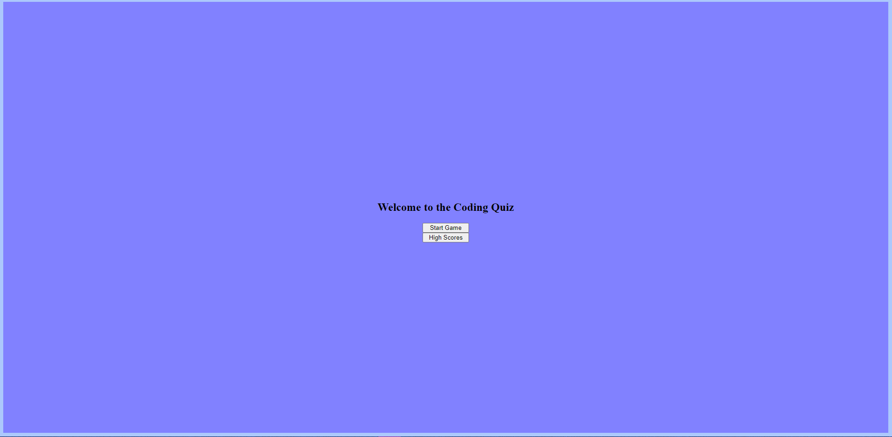

# Coding-Quiz
## Description
* A quiz that prompts the user to answer question before the timer hits 0. A total of 4 questions asked, and each question answered incorrectly results in 15 seconds lost from the original 90 seconds that they start with. The quiz is fitted with a "Highscores" page with user submition to enter their intials to keep track of their results.

## Functionality
* The quiz has:
 * A home screen.
 * A highscore page.
 * An end game screen.
 * The ability to clear all scores from local storage

## Screenshot of finished product

## Links

[Link to Github](https://github.com/jacobduden/Coding-Quiz)

[Deployed site](https://jacobduden.github.io/Coding-Quiz/)